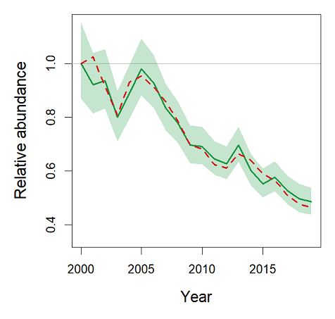

```{=html}
<style>
body{
  text-align: justify;
}

h1{
font-size:200%;
text-align: center;
}
</style>
```
```{r setup, echo = FALSE}
knitr::opts_chunk$set(
	message = FALSE,
	warning = FALSE,
	autodep = TRUE,
	cache = TRUE
)
```

### Introduction

This vignette presents a method for generating a virtual species (VS) by reverse engineering of spatiotemporal ecological models. By combining the VS with an observational process, the virtual ecologist (VE) data are generated, which vary both spatially and temporally in
a way that resembles patterns generated by ecological studies.

The framework consists of: (1) fitting a spatiotemporal model to real abundance data; (2) generating a VS population from that model; and (3) obtaining the VE data by sampling from the VS. In this way, synthetic data are generated, which can be applied for evaluation of
various ecological modelling techniques, where real-world properties are of particular importance, like conservation and invasion biology or climate change impact assessment.

To illustrate the method, we used data from a long-term and large-scale bird abundance monitoring scheme, using the the [whinchat](https://en.wikipedia.org/wiki/Whinchat){target="_blank"} (*Saxicola rubetra*) as a study system. We evaluated how well the spatiotemporal model fitted by a generalized additive mixed model (GAMM) can reconstruct the ‘true’ system by comparing response curves of habitat suitability and population trends between those used to generate the VS (i.e., what constitutes the ‘truth’) and those estimated from the VE data.

### Step 1: Fitting a model to real spatio-temporal population abundance data

First, load necessary packages:

```{r libraries, echo=TRUE}
library(mgcv)
library(parallel)
library(terra)
library(data.table)
library(fst)
library(RColorBrewer)
```

### The data

The real population data that form a prototype for a VS originate from the Common Breeding Bird Survey in Poland ([MPPL](https://monitoringptakow.gios.gov.pl/about-project.html){target="_blank"}) and contain information on whinchat population density at 1110 survey plots (1 km^2^ each) in 2000–2019.

Environmental predictors that were used for distribution modelling provide information on topography ([SRTM 90m Digital Elevation Database](https://cgiarcsi.community/data/srtm-90m-digital-elevation-database-v4-1/){target="_blank"}), land cover ([ESA CCI Land Cover](https://www.esa-landcover-cci.org/){target="_blank"}) and climate ([TerraClimate](https://www.climatologylab.org/terraclimate.html){target="_blank"}). Three topographic predictors were static, while the others were dynamic.

Loading the data:

```{r data, echo=TRUE}
load("data/data.RData")
```

The data contain information on both species abundance and environmental predictors:

| Variable          | Description                                                   |
|-----------------------|-------------------------------------------------|
| id                | A unique identifier for each 1-km^2^ square                  |
| id_year           | Combination of square and year identifiers                    |
| plot_id           | Sampling plot identifier                                      |
| observer_id       | Observer identifier                                           |
| x                 | Easting [km]                                                  |
| y                 | Northing [km]                                                 |
| year              | Year                                                          |
| fyear             | Year as a factor                                              |
| dens              | Whinchat population density [pairs/km^2^]                     |
| Cropland          | Herbaceous cropland cover [%]                                 |
| Mosaic_cropland   | Mosaic cropland (\>50%) / natural vegetation (\<50%) [%]      |
| Grassland         | Grassland [%]                                                 |
| Urban             | Urban areas [%]                                               |
| Forest            | Forest cover [%]                                              |
| Precip_spring_lag | Total precipitation in previous spring [mm] (log-transformed) |
| Precip_summer_lag | Total precipitation in previous summer [mm] (log-transformed) |
| Precip_winter     | Total precipitation in winter [mm] (log-transformed)          |
| Precip_spring     | Total precipitation in spring [mm] (log-transformed)          |
| Tmax_summer_lag   | Average of maximum temperatures in previous summer [°C]       |
| Tmin_spring_lag   | Average of minimum temperatures in previous spring [°C]       |
| Tmin_summer_lag   | Average of minimum temperatures in previous summer [°C]       |
| Tmin_winter       | Average of minimum temperatures in winter [°C]                |
| Tmin_spring       | Average of minimum temperatures in spring [°C]                |
| Elevation         | Height above sea level [m a.s.l.] (cube-root-transformed)     |
| Roughness         | Topographic roughness index (cube-root-transformed)           |
| Wetness           | Topographic wetness index (log-transformed)                   |

### The model

Any modelling technique can be used to fit the spatio-temporal model. Here, generalized additive mixed models were used (GAMM, Wood 2017), as they produce smooth response curves, can handle a bunch of distributions, and flexibly allow modelling processes that improve ecological realism, like autocorrelation, random factors, etc.

In this model, both species and environmental data are allowed to be dynamic, i.e. they vary in both space and time:

$$N_{i,t}\sim T_p(\mu_{i,t},\sigma^2)$$

$$\ln(\mu_{i,t})=\alpha+\sum_{j=1}^mf_j\left(X_{i,t,j}\right)+\mathcal{GP}(f_t(t),u(t,t\prime))+\mathcal{GP}(f_s(x),v(x,x\prime))+ a_i + b_{i,t}$$

$$u(t,t\prime)=c_0(\|t-t\prime\|, \rho_t), \qquad v(x,x\prime)=c_0(\|x-x\prime\|, \rho_x)$$

$$c_0(d, \rho)=(1+d/\rho)\exp(-d/\rho)$$

$$a_i \sim N(0,\sigma_{plot}^2), \qquad b_t \sim N(0,\sigma_{year}^2), \qquad o_{i,t} \sim N(0,\sigma_{obs}^2)$$

Here, population density $N_{i,t}$, which is assumed to come from the compound Poisson-Gamma (Tweedie) distribution, is indexed by site identifier $i$ and year identifier $t$. The natural logarithm of expected density $μ_{i,t}$ is the sum of smooth functions fitted to $m$ predictors that vary in both space and time.

Additionally, the model is enhanced by including several components that represent the following processes.

1.  Temporal autocorrelation (representing the population trend by allowing a smooth, serially autocorrelated transition of population density over time), modelled as a Gaussian process $GP$ with the mean $f_t$ and covariance matrix $u$. The elements of matrix $u$ are modelled as a function of a between-year distance by using the Matérn correlation function $c_0$ with parameter $ρ_t$.

2.  Spatial autocorrelation (representing dispersal or large-scale habitat gradients), modelled as a 2-D Gaussian process.

3.  Random spatial variation (representing spatial variability in population densities that are not captured by other processes), modelled as a normally distributed random intercept $a_i$ with a mean at zero and variance $σ_{plot}^2$.

4.  Random temporal variation (representing between-year variability), modelled as a normally distributed random intercept $b_t$ with a mean at zero and variance $σ_{year}^2$.

5.  Observational process (representing differences between observers), modelled as a normally distributed random intercept $o_{i,t}$ with a mean at zero and variance $σ_{obs}^2$.

First we load the full model.

```{r load-fulls}
load("data/gamm_full.RData")
```

We performed model selection using a backward stepwise elimination algorithm, as recommended by Marra & Wood (2011). However, it takes some time, so for the purpose of this vignette we present just the final model.

```{r load-model, echo=TRUE}
load("data/gamm_selected.RData")
summary(fit, re.test = FALSE)
```

Here are smooth components of the fitted GAMM:

```{r response-curves, echo=TRUE, fig.height=7, fig.width=7}
par(mar = c(5, 2.8, 1, 1))
plot(fit, scale = 0, pages = 1, scheme = 2, residuals = FALSE)
```

## Step 2: Generating a virtual species

First, load spatiotemporal environmental data.

```{r load-ndata, echo=TRUE}
vs <- read.fst("data/ndata.fst")
```

These data contain information for every 1 km^2^ square in Poland, spanning 20 years (313368 km^2^ \* 20 years \* 17 environmental variables). Now, to accelerate the processing, convert this rather large dataset to data.table and add a new variable, which is simply a factor of year:

```{r data-table, echo=TRUE}
vs <- data.table(vs, key = "id_year")
vs[["fyear"]] <- factor(vs[["year"]])
```

The `predict.bam` function, when used with `discrete=TRUE` option, needs all variables to be provided (even if they are next excluded, when making predictions).

```{r ids, echo=TRUE}
vs[["plot_id"]] <- factor(levels(fit[["model"]][["plot_id"]])[1])
vs[["observer_id"]] <- factor(levels(fit[["model"]][["observer_id"]])[1])
```

Now, calculate predictions from the model on a link scale. Random intercepts for study sites and observers, are set to zero. This is necessary because when fitting the model, random intercepts can be estimated only for the survey plots that were originally included in the data, but not for all sites within the target area (however, their distributional characteristics could be estimated – see the next step). In case of random intercepts for observers, they were set to zero to remove the observational error at this stage – although they will be reconstructed later (see below, Step 3: Virtual ecologist).

```{r predict, echo=TRUE}
vs[["eta"]] <- predict(fit, vs, type = "link", exclude = c("s(plot_id)", "s(observer_id"))
```

Then, random intercepts for all survey plots within the study area are simulated by drawing a random sample from the normal distribution with a mean at zero and variance $σ_{plot}^2$ estimated while fitting the GAMM model.

```{r sd-plot-id, echo=TRUE}

gv <- gam.vcomp(fit)

sd_plot_id <- gv["s(plot_id)", "std.dev"]
id <- sort(unique(vs[["id"]]))

set.seed(123)
id_r <- data.table(id = id, id_r = rnorm(length(id), 0, sd_plot_id))

```

These intercepts are added to the predictions (on a link scale):

```{r add-intercepts}
vs <- merge(vs, id_r, by = "id")
vs[["etar"]] <- vs[["eta"]] + vs[["id_r"]]
```

Next, the inverse link function is applied, giving expected densities for each study plot.

```{r backtransform, echo=TRUE}

trans <- fit[["family"]][["linkinv"]]
vs[["mu"]] <- trans(vs[["eta"]]) # expected
vs[["mur"]] <- trans(vs[["etar"]]) # expected + random spatial variation
```

Finally, using estimated parameters of the Tweedie distribution, i.e. shape parameter $\theta$ and dispersion parameter $\phi$, a single random draw is generated from this distribution by using expected densities obtained in the previous step.

```{r tw-param, echo=TRUE}

p <- fit$family$getTheta(TRUE) # the shape parameter
phi <- fit$deviance / fit$df.residual # the scale parameter using the deviance method

set.seed(123)
vs[["sim_dr"]] <- rTweedie(vs[["mur"]], p, phi) # random draw from the process distribution

vs <- vs[, c("id_year", "id", "year", "fyear", "x", "y", "mu", "mur", "sim_dr")]
```

Now we can generate predictive maps for individual years.

```{r maps, echo=TRUE, fig.height=6, fig.width=6}

source("R/maps.R") # custom function written to handle spatiotemporal map drawing

maps(vs, vname = "mu") # expected population densities
maps(vs, "sim_dr") # as above, but the reconstructed spatial random variation is added

```

## Step 3: Virtual ecologist

The VS generated according to the above procedure is taken as truth.

To reconstruct the sampling process, a real sampling scheme is replicated by using exactly the same set of sites which were sampled exactly at the same time as in reality.

```{r sampling, echo=TRUE}

load("data/data.RData") # real data
ve <- data.table(data, key = "id_year")
ve <- ve[, c("id", "year", "fyear","x", "y") := NULL] # removing duplicated variables
ve <- merge(ve, vs, by = "id_year")
ve <- ve[complete.cases(ve), ]

```

Sampling error $p$, associated with individual observers, was generated as a random draw from a lognormal distribution with a mean of 1 and variance $σ_{obs}^2$, which was estimated when fitting the GAMM model at Step 1. This error allows virtual observers to underestimate abundance (if $p<1$, due to imperfect detectability, for example), but also to overestimate it (if $p>1$, for instance due to double counting). After that, the population densities of VS 'observed' at the original sites by virtual observers were multiplied by a relevant $p$.

```{r observer error, echo = TRUE}

# Observer error
gv <- gam.vcomp(fit)

sd_id_obs <- gv["s(observer_id)", "std.dev"] # estimated SD for observer random intercepts
obs <- sort(unique(ve[["observer_id"]]))

set.seed(123)
obs_r <- data.frame(observer_id = obs, obs_r = rlnorm(length(obs), 0, sd_id_obs))

ve <- merge(ve, obs_r, by = "observer_id")
ve[, sim := sim_dr * obs_r]

```

To check if the patterns generated from the VE data can mirror the patterns in the actual data (i.e., population densities estimated by using the real surveys), a posterior predictive check is used (Gelman and Hill 2007).

```{r pp-check, echo=TRUE, fig.height=5, fig.width=5}

source("R/pp_check.R") # custom function to make pp check

# Posterior predictive check of log-densities
pp_check(log1p(data$dens), log1p(ve$mu)) # expected
pp_check(log1p(data$dens), log1p(ve$sim)) # expected with random variation, process variation, observation error

```

Comparing population density distributions:

```{r pp, echo=TRUE, fig.height=3, fig.width=7}

breaks <- seq(0, 5, 0.5)
cex.lab <- 1.3
col <- adjustcolor("black", alpha = 0.15)

op <- par(mfrow = c(1, 3), mar = c(5, 5, 1, 1))
hist(log1p(data$dens), breaks = breaks, freq = FALSE, ylim = c(0, 1.1), main = "", xlab = "Observed log-densities", ylab = "Probability density", cex.lab = cex.lab, col = col)
hist(log1p(ve$sim), breaks = breaks, freq = FALSE, ylim = c(0, 1.1), main = "", xlab = "Simulated log-densities", ylab = "Probability density", cex.lab = cex.lab, col = col)
plot(log1p(data$dens), log1p(ve$sim), asp = 1, xlab = "Observed log-densities", ylab = "Simulated log-densities", cex.lab = cex.lab, col = col)
grid(); abline(a = 0, b = 1, lty = 2)
par(op)

```

## Step 4: Fitting the spatiotemporal model to VE data

As a result, the VE data replicated the original data set. The truth behind them is now known, allowing for testing any hypotheses concerning the underlying processes, both ecological and observational.

First, we fitted a GAMM model to the VE data. The model formula is the same as for the full model that was used while running the procedure of generating the VS, but now the response is the abundance estimated by a VE.

```{r formula-update}
fs <- update(formula(full), sim ~ .)
```

Next, we load the full model fitted to virtual ecologist data.

```{r sim-full}
load("data/sim_full.RData")
```

Then, we performed a model selection using backward elimination. As previously, for the purposes of this vignette, we present only the resulting model.

```{r sim-fit, echo=TRUE}

load("data/sim_selected.RData")
summary(sim_fit, re.test = FALSE)
```

## Step 5: Evaluating the VE model by comparing its predictions with the VS data

### Reconstructing response curves

First, let us check how well the GAMM model can reconstruct original response curves (functions defining environment-abundance relationships). To do so, one can fit a GAMM model to the VE data by using the original sampling scheme, the same model structure and model selection approach as described in Step 1 above.

We can compare the response curves that were used to generate the VS (dashed red lines) with fitted curves estimated based on VE data (green).


```{r compare, echo=TRUE, fig.height=6, fig.width=7}

source("R/compare.R") # custom function to compare response curves

out <- c("plot_id", "observer_id", "fyear", "x", "y", "year") # variables to exclude from the comparison

# Calculating partial residuals:
reference <- part_res(fit, out) # reference model, i.e. the model used to generate a virtual species
full <- part_res(sim_full, out) # full model fitted to the VE data
fitted <- part_res(sim_fit, out) # final model fitted to the VE data

m <- compare(reference, fitted, scale = 0)
m$r # corelation coefficients
m$coverage # coverage percentages

# Correctness of variable selection:
m <- compare(reference, fitted, full, plot.me = FALSE)
table(selected = m$vfit, reference = m$vref)

```

### Reconstructing population trends

Second, we can check how well a population trend estimated using the ongoing monitoring scheme can inform about the 'true' population trend. Comparing VE trend estimates with the 'true' VS trend allows us to assess it.

We fitted a simple model to estimate the population trend.

```{r vs-trend, echo=TRUE, fig.height=5, fig.width=4}

# The trend estimated based on VE data

nthreads <- parallel::detectCores(logical = FALSE) # no. of cores to be used in 'bam'

ft <- bam(sim ~ year + s(fyear, bs = "re") + s(plot_id, bs = "re"), data = ve, family = tw, discrete = TRUE, nthreads = nthreads)
summary(ft)

```

The 'true' trend was calculated as population density means taken from the VS.

```{r true-trend, echo=TRUE}
true_d <- tapply(vs$sim_d, vs$year, mean, na.rm = TRUE)
true_d <- true_d / true_d[1] # relative abundance
```

Comparison of the population trends estimated using VE data (green) with the 'true' trend of VS (red):



## References

Gelman, Andrew, and Jennifer Hill. (2007). Data Analysis Using Regression and Multilevel/Hierarchical Models. Vol. Analytical Methods for Social Research. New York, Cambridge University Press. <https://doi.org/10.1017/cbo9780511790942>.

Marra, Giampiero and Wood, Simon N. (2011). Practical variable selection for generalized additive models. Computational Statistics & Data Analysis, 55(7), 2372--2387. <https://doi.org/10.1016/j.csda.2011.02.004>

Wood, Simon N. (2017). Generalized Additive Models: An Introduction with R, 2nd edition. Chapman and Hall/CRC. <https://doi.org/10.1201/9781315370279>
